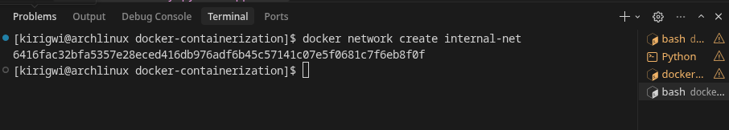
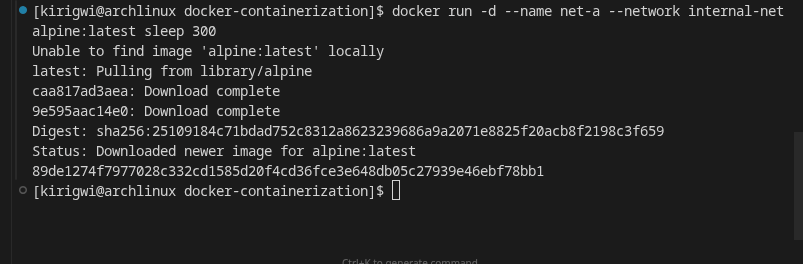
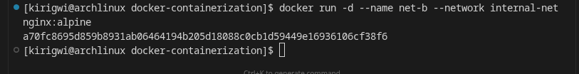
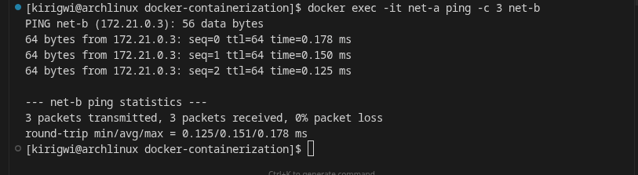
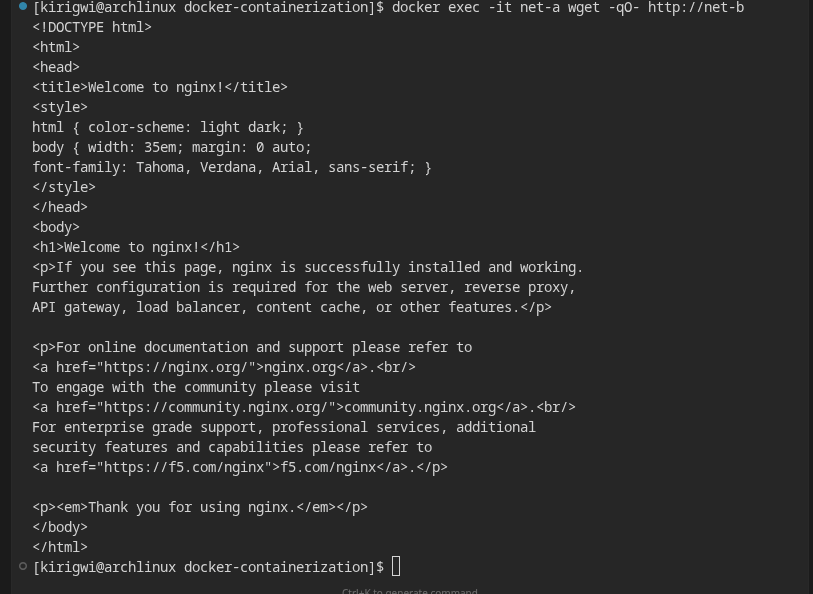

# Docker checkpoint — replication guide

**New here?** Read **`START_GUIDE.md`** first — short story of how the stack fits together.

This folder contains everything needed to reproduce : **Nginx load balancing** across **two Flask backends**, **MySQL** with a **named volume**, and step-by-step **Docker CLI** exercises.

**Repository / images:** Build locally from this directory, or pull a published image from a registry (see **Image registry** at the end).

---

## Prerequisites

- Docker Engine + Docker Compose v2 (`docker compose`)
- Ports **80** (Nginx) free; adjust in `docker-compose.yml` if needed

---

## 1. Docker basics & CLI (standalone)

These use **temporary** containers; they do not depend on `docker-compose.yml`.

### Pull Nginx

```bash
docker pull nginx:latest
```

### Run detached, host 8080 → container 80

```bash
docker run -d --name nginx-demo -p 8080:80 nginx:latest
```

### Exec into the container and list the default site

```bash
docker exec -it nginx-demo sh -c 'ls -la /usr/share/nginx/html'
```

### Restart and confirm it still runs

```bash
docker restart nginx-demo
docker ps --filter name=nginx-demo
```

### Remove container and image

```bash
docker stop nginx-demo
docker rm nginx-demo
docker rmi nginx:latest
```

---

## 2. Dockerfile & custom image (`my-python-app:v1`)

From **`docker-containerization/`** (this directory):

```bash
docker build -t my-python-app:v1 .
```

### Run the app (host port 5000)

```bash
docker run --rm -p 5000:5000 my-python-app:v1
```

Open **http://127.0.0.1:5000** — you should see the HTML joke UI.

### Inspect layers

```bash
docker history my-python-app:v1
```

**Files involved:** `Dockerfile`, `app.py`, `requirements.txt`

---

## 3. MySQL + volume (standalone persistence demo)

### Run MySQL with a named volume and env vars

```bash
docker volume create mysql-assignment-data

docker run -d \
  --name mysql-demo \
  -e MYSQL_ROOT_PASSWORD=secret \
  -e MYSQL_DATABASE=demoapp \
  -v mysql-assignment-data:/var/lib/mysql \
  -p 3306:3306 \
  mysql:8.0
```

Wait ~15–30s for MySQL to be ready, then:

```bash
docker exec -it mysql-demo mysql -uroot -psecret -e "USE demoapp; CREATE TABLE IF NOT EXISTS t1 (id INT); INSERT INTO t1 VALUES (42); SELECT * FROM t1;"
```

### Stop and remove the container (keep the volume)

```bash
docker stop mysql-demo
docker rm mysql-demo
```

### New container, **same volume** — data must still exist

```bash
docker run -d \
  --name mysql-demo2 \
  -e MYSQL_ROOT_PASSWORD=secret \
  -e MYSQL_DATABASE=demoapp \
  -v mysql-assignment-data:/var/lib/mysql \
  -p 3306:3306 \
  mysql:8.0
```

```bash
docker exec -it mysql-demo2 mysql -uroot -psecret -e "USE demoapp; SELECT * FROM t1;"
```

### Cleanup (optional)

```bash
docker stop mysql-demo2 && docker rm mysql-demo2
docker volume rm mysql-assignment-data
```

---

## 4. Custom network: ping & curl between containers

```bash
docker network create internal-net
```



```bash
docker run -d --name net-a --network internal-net alpine:latest sleep 300
```



```bash
docker run -d --name net-b --network internal-net nginx:alpine
```



```bash
docker exec -it net-a ping -c 3 net-b
```



```bash
docker exec -it net-a wget -qO- http://net-b
```



Cleanup:

```bash
docker rm -f net-a net-b
docker network rm internal-net
```

---

## 5. Full stack — Compose (Nginx + 2 Flask backends + MySQL)

**Concept:** Nginx **`upstream`** lists **`backend-1:5000`** and **`backend-2:5000`** (round-robin). The UI shows **`container_hostname`** changing between requests — proof of load balancing. MySQL uses volume **`mysql_data`**; **`init.sql`** seeds tables on **first** init only.

### Build and start

```bash
cd /path/to/docker-containerization

docker compose build
docker compose up -d
```

(Optional) copy env:

```bash
cp .env.example .env
# edit passwords if needed — match any manual mysql client commands
```

### Verify in browser

- **http://localhost** — page loads through Nginx  
- Refresh **`/api/joke`** or watch the **Backend** field — hostname alternates between the two Flask containers

### Logs and process list

```bash
docker compose logs -f
docker compose ps
```

### Stop / remove stack (keep MySQL volume)

```bash
docker compose down
```

### Remove stack **and** named volume (destructive)

```bash
docker compose down -v
```

---

## File map

| File | Purpose |
|------|--------|
| `Dockerfile` | `python:3.12-slim`, install deps, `CMD python app.py` |
| `docker-compose.yml` | `backend-1`, `backend-2`, `nginx`, `mysql`, network `app-net`, volume `mysql_data` |
| `nginx.conf` | `upstream` with two Flask servers; reverse proxy on port 80 |
| `init.sql` | Seed DB on first MySQL init (empty volume) |
| `requirements.txt` | Python dependencies |
| `app.py` | Flask app; exposes `container_hostname` for LB demo |
| `.env.example` | Example MySQL credentials |
| `docker-compose.from-hub.yml` | Same stack using a pre-pulled Hub image for both backends (no local `docker build`) |

---

## Image registry: push, pull, and run

Images must be tagged with **`yourusername/imagename`** (not bare `imagename`), or Docker assumes **`library/`** on Docker Hub and push fails.

### Publish a local build

```bash
docker build -t my-python-app:v1 .
docker tag my-python-app:v1 YOUR_USER/my-python-app:v1
docker login
docker push YOUR_USER/my-python-app:v1
```

Replace **`YOUR_USER`** with your Docker Hub (or GitLab registry) path.

### Pull and run on another machine

Download the image and start one container (host port 5000 → app):

```bash
docker pull YOUR_USER/my-python-app:v1
docker run --rm -p 5000:5000 YOUR_USER/my-python-app:v1
```

Open **http://127.0.0.1:5000**. This is **one** Flask instance (no Nginx load balancing). Without MySQL env vars, jokes fall back to in-memory (`joke_source: memory` in `/api/joke`).

**Example (published image name):**

```bash
docker pull kirigwidev/my-python-app:v1
docker run --rm -p 5000:5000 kirigwidev/my-python-app:v1
```

Browse the repo on Docker Hub: **`https://hub.docker.com/r/YOUR_USER/my-python-app`** (tags, digest, copy-paste pull command).

### Load balancing after a pull

Use **`docker-compose.from-hub.yml`** with **`nginx.conf`** and **`init.sql`** in the same folder so two containers plus Nginx run from the pulled image (see **`START_GUIDE.md`**).
